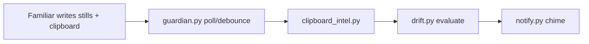

# Focus Guardian + Familiar — Architecture

## Vision

**Familiar** = continuous sensor (screen OCR, window metadata, clipboard / Wispr).  
**Focus Guardian** = portable brain that reads that stream, detects **sustained drift**, and chimes in — without you running `fg review` mid-session.

**`fg review`** = retrospective over hours (work blocks + full transcription excerpts). Separate from live guardian.

## Data flow (proactive v0.3)



1. Familiar writes `*.md` and `*.clipboard.txt` under `stills-markdown`.
2. Guardian tracks latest mtime; on new files, waits `debounceSeconds` (~60s).
3. `clipboard_intel` loads full Wispr text, merges utterances, scores topic vs goal.
4. `drift` evaluates rolling `evaluationWindowMinutes` (~30m) for **sustained** patterns.
5. If `should_chime` and cooldown elapsed → macOS notification with Wispr excerpt + nudge.

## What Familiar already gives you

| Signal | Format | Notes |
|--------|--------|-------|
| Screen | `session-*/TIMESTAMP.md` | App, window title, OCR |
| Clipboard / Wispr | `*.clipboard.txt` | Full dictation text — primary intent |
| Sequence | Timestamps in filenames | Chronological order |

Repo: [familiar-software/familiar](https://github.com/familiar-software/familiar) (MIT)

## Intervention modes

| Mode | Behavior |
|------|----------|
| `proactive` (default) | `fg guardian start` — event-driven drift + chime |
| `manual` | No background daemon; use `fg review` / `fg coach` |
| `on_demand` | Alias for manual (legacy config value) |

## Proactive settings (`config.proactive`)

| Key | Default | Role |
|-----|---------|------|
| `pollSeconds` | 90 | Fallback poll for new Familiar files |
| `debounceSeconds` | 60 | Wait after new clipboard before evaluate |
| `evaluationWindowMinutes` | 30 | Rolling drift window |
| `driftSustainedMinutes` | 10 | Min sustained off-topic before chime |
| `wisprMinChars` | 80 | Classify as transcription vs short copy |
| `maxClipboardChars` | 8000 | Cap for timeline + intel |
| `chimeCooldownMinutes` | 25 | Min gap between notifications |

## Profiles

### `job_search`

Proactive on, assignment keywords, anti-patterns for polish/AI loops and meta-tooling.

```bash
fg profile job_search
fg guardian start
fg review --human   # end of session
```

### `employed`

Default `manual` — you may enable proactive when ready.

## Primary commands

```bash
fg guardian start     # proactive daemon (product default)
fg guardian stop
fg guardian once      # evaluate now + chime if warranted
fg review --human     # retrospective narrative
fg coach
fg goal "..." -k kw1,kw2
```

## Roadmap (out of scope v0.3)

- Zoom/call audio — Familiar fork or screenpipe pairing
- Native menu bar app wrapping same Python core
- Weekly digest (`fg week`)

## Portable across machines

1. `git clone` focus-guardian  
2. Install Familiar on each Mac  
3. Sync `~/.focus-guardian/config.json`  
4. `fg guardian start` per machine (Familiar data stays local)
